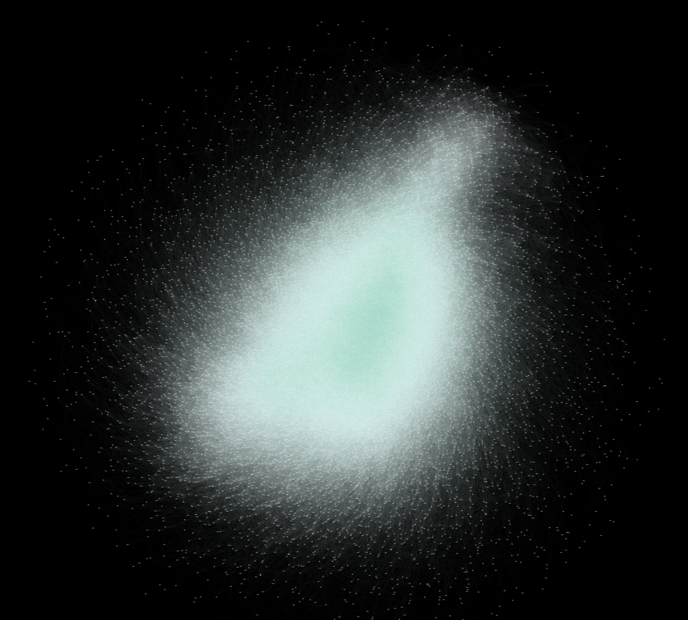

# Actor-Graph-Visualization
A data visualization project to visualize a dataset of the top 10,000 actors on imdb as a multi edged graph.

I've used Gephi for graph vizualisations, all code is in the Jupyter notebook `dv_project.ipynb`.

